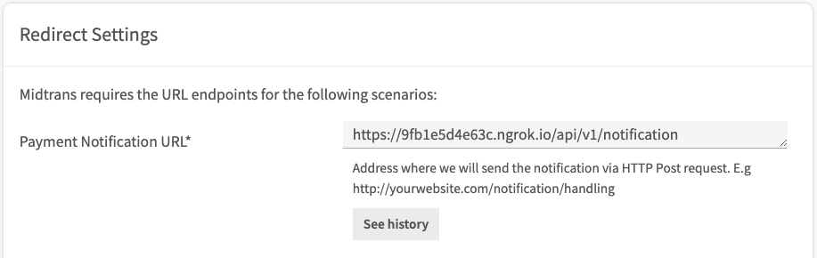
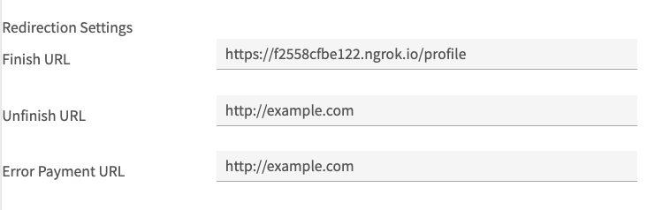

# Payment gateway with midtrans

`Midtrans` is a payment gateway that facilitates the needs of online businesses by providing services in various payment methods. This service allows industry players to operate more easily and increase sales. The payment methods provided are card payment, bank transfer, direct debit, e-wallet, over the counter, and others.

## Prepare

#### How to use ngrok for create public URLs

- Run application `npm run dev` on server side

- Open new terminal

- Install [Localtunnel](https://localtunnel.github.io/www/) globally to make it accessible anywhere :

  ```test
    npm install -g localtunnel
  ```

* Run localtunnel with port `3000` for client side :

  ```text
    lt --port 3000
  ```

* Run localtunnel with port `5000` for server side :

  ```text
    lt --port 5000
  ```

#### Configuration on midtrans

- Create [midtrans](https://midtrans.com/) account and login

* Insert public URLs for Payment Notification :

  > Path : `settings/configuration`

  

  Reference : [Http notification / Webhooks of Payment Status](https://docs.midtrans.com/en/after-payment/http-notification)

* Insert public URLs for Redirection Finish URL :

  > Path : `settings/snap preferences` and scroll down

  

- Install midtrans-client on server side

  ```text
  npm i midtrans-client
  ```

# Server side (Backend)

`SNAP` is a payment portal that allows merchants to display the Midtrans payment page directly on the website.

API request should be done from merchant backend to acquire Snap transaction token by providing payment information and Server Key. There are at least three components that are required to obtain the Snap token (`server_key`, `order_id`, `gross_amount`)

### Modify transaction controller :

> File : `server/src/controllers/transactions.js`

- Import midtrans-client :

  ```javascript
  const midtransClient = require("midtrans-client");
  ```

#### Add Transaction function

- Prepare transaction data from body :

  ```javascript
  let data = req.body;
  data = {
    id: parseInt(data.idProduct + Math.random().toString().slice(3, 8)),
    ...data,
    idBuyer: req.user.id,
    status: "pending",
  };
  ```

- Insert transaction data :

  ```javascript
  const newData = await transaction.create(data);
  ```

- Get buyer data :

  ```javascript
  const buyerData = await user.findOne({
    include: {
      model: profile,
      as: "profile",
      attributes: {
        exclude: ["createdAt", "updatedAt", "idUser"],
      },
    },
    where: {
      id: newData.idBuyer,
    },
    attributes: {
      exclude: ["createdAt", "updatedAt", "password"],
    },
  });
  ```

- Create Snap API instance :

  ```javascript
  let snap = new midtransClient.Snap({
    // Set to true if you want Production Environment (accept real transaction).
    isProduction: false,
    serverKey: process.env.MIDTRANS_SERVER_KEY,
  });
  ```

- Parameter :

  ```javascript
  let parameter = {
    transaction_details: {
      order_id: newData.id,
      gross_amount: newData.price,
    },
    credit_card: {
      secure: true,
    },
    customer_details: {
      full_name: buyerData?.name,
      email: buyerData?.email,
      phone: buyerData?.profile?.phone,
    },
  };
  ```

- Create transaction :

  ```javascript
  const payment = await snap.createTransaction(parameter);
  ```

* Create transaction sample response:

  ```json
  {
    "token": "66e4fa55-fdac-4ef9-91b5-733b97d1b862",
    "redirect_url": "https://app.sandbox.midtrans.com/snap/v2/vtweb/66e4fa55-fdac-4ef9-91b5-733b97d1b862"
  }
  ```

#### Handle payment gateway with midtrans

- To get `server key` and `client key`, refer to [Retrieving API Access Keys](https://docs.midtrans.com/en/midtrans-account/overview?id=retrieving-api-access-keys)

* Configurate midtrans client with CoreApi

  ```javascript
  const MIDTRANS_CLIENT_KEY = process.env.MIDTRANS_CLIENT_KEY;
  const MIDTRANS_SERVER_KEY = process.env.MIDTRANS_SERVER_KEY;

  const core = new midtransClient.CoreApi();

  core.apiConfig.set({
    isProduction: false,
    serverKey: MIDTRANS_SERVER_KEY,
    clientKey: MIDTRANS_CLIENT_KEY,
  });
  ```

* Handle HTTP(s) Notification / Webhooks of Payment status.

  ```javascript
  exports.notification = async (req, res) => {
    try {
      const statusResponse = await core.transaction.notification(req.body);
      const orderId = statusResponse.order_id;
      const transactionStatus = statusResponse.transaction_status;
      const fraudStatus = statusResponse.fraud_status;

      console.log(statusResponse);

      if (transactionStatus == "capture") {
        if (fraudStatus == "challenge") {
          // TODO set transaction status on your database to 'challenge'
          // and response with 200 OK
          updateTransaction("pending", orderId);
          res.status(200);
        } else if (fraudStatus == "accept") {
          // TODO set transaction status on your database to 'success'
          // and response with 200 OK
          updateProduct(orderId);
          updateTransaction("success", orderId);
          res.status(200);
        }
      } else if (transactionStatus == "settlement") {
        // TODO set transaction status on your database to 'success'
        // and response with 200 OK
        updateTransaction("success", orderId);
        res.status(200);
      } else if (
        transactionStatus == "cancel" ||
        transactionStatus == "deny" ||
        transactionStatus == "expire"
      ) {
        // TODO set transaction status on your database to 'failure'
        // and response with 200 OK
        updateTransaction("failed", orderId);
        res.status(200);
      } else if (transactionStatus == "pending") {
        // TODO set transaction status on your database to 'pending' / waiting payment
        // and response with 200 OK
        updateTransaction("pending", orderId);
        res.status(200);
      }
    } catch (error) {
      console.log(error);
      res.status(500);
    }
  };
  ```

  [Reference](https://docs.midtrans.com/en/after-payment/http-notification)

- Handle update transaction status :

  ```javascript
  const updateTransaction = async (status, transactionId) => {
    await transaction.update(
      {
        status,
      },
      {
        where: {
          id: transactionId,
        },
      }
    );
  };
  ```

- Handle update product stock/qty :

  ```javascript
  const updateProduct = async (orderId) => {
    const transactionData = await transaction.findOne({
      where: {
        id: orderId,
      },
    });
    const productData = await product.findOne({
      where: {
        id: transactionData.idProduct,
      },
    });
    const qty = productData.qty - 1;
    await product.update({ qty }, { where: { id: productData.id } });
  };
  ```

> File : `server/src/routes/index.js`

- Add notification routes with POST method:

  ```javascript
  ...
  router.post("/notification", notification);
  ...
  ```

# Client side (Frontend)

Displaying Snap Payment Page on Frontend.

[Reference](https://docs.midtrans.com/en/snap/integration-guide?id=_2-displaying-snap-payment-page-on-frontend)

> File : `client/src/pages/DetailProduct.js`

- Config Snap payment page with useEffect :

  ```javascript
  ...
  useEffect(() => {
    //change this to the script source you want to load, for example this is snap.js sandbox env
    const midtransScriptUrl = "https://app.sandbox.midtrans.com/snap/snap.js";
    //change this according to your client-key
    const myMidtransClientKey = "Client key here ...";

    let scriptTag = document.createElement("script");
    scriptTag.src = midtransScriptUrl;
    // optional if you want to set script attribute
    // for example snap.js have data-client-key attribute
    scriptTag.setAttribute("data-client-key", myMidtransClientKey);

    document.body.appendChild(scriptTag);
    return () => {
      document.body.removeChild(scriptTag);
    };
  }, []);
  ...
  ```

  [Reference](https://docs.midtrans.com/en/other/faq/technical?id=my-developer-uses-react-js-frontend-framework-and-is-unable-to-use-midtransminjssnapjs-what-should-i-do)

* Modify handle buy to display Snap payment page :

  ```javascript
  ...
  // Insert transaction data
  const response = await api.post("/transaction", config);

  const token = response.payment.token;

  window.snap.pay(token, {
    onSuccess: function (result) {
      /* You may add your own implementation here */
      console.log(result);
      history.push("/profile");
    },
    onPending: function (result) {
      /* You may add your own implementation here */
      console.log(result);
      history.push("/profile");
    },
    onError: function (result) {
      /* You may add your own implementation here */
      console.log(result);
    },
    onClose: function () {
      /* You may add your own implementation here */
      alert("you closed the popup without finishing the payment");
    },
  });
  ...
  ```
